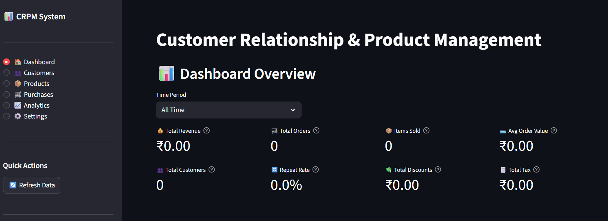

<div align="center">

# Customer Relationship & Product Management

A comprehensive **CRM + Inventory + Purchase Tracking** system built with **Streamlit** and **SQLite**, featuring advanced analytics, enhanced data models, and professional-grade business management capabilities.




</div>

## ✨ Features

### 📊 Dashboard
- Real-time revenue, orders, items sold, average order value
- Customer metrics: total customers, repeat rate, new customers
- Revenue trends with interactive charts
- Top 5 products and customers
- Recent purchase activity
- Date range filters (Today, Last 7/30/90 Days, All Time)

### 👥 Customer Management
- Complete customer profiles with address, city, state, postal code
- Customer types: retail, wholesale, corporate
- Company information and tax ID for B2B customers
- Email, phone, and contact details
- Search and filter across all fields
- Loyalty points tracking
- Purchase history per customer
- Active/inactive status management

### 📦 Product Management
- Professional product catalog with SKU and barcode
- Dual pricing: selling price and cost price (profit margin tracking)
- Inventory management with automatic stock updates
- Reorder levels and quantities for low-stock alerts
- Multi-level categorization: category, subcategory, brand
- Product tags for flexible organization
- Multiple unit types: piece, kg, liter, meter, pack
- Supplier tracking
- Featured products flag
- Status: available, out of stock, discontinued

### 🛒 Purchase Management
- Easy purchase recording with customer and product selection
- Flexible discount options: percentage or fixed amount
- Tax calculation (GST/VAT support)
- Multiple payment methods: cash, card, UPI, bank transfer, credit
- Payment status tracking: paid, pending, partial, refunded
- Order status: completed, pending, cancelled, returned
- Delivery status tracking
- Transaction ID for digital payments
- Automatic stock deduction
- Real-time order summary calculations

### 📈 Analytics & Reports
- **Sales Analytics:** Monthly breakdown, revenue trends, sales pivot tables
- **Customer Analytics:** Top customers by revenue/orders, retention metrics, repeat rate
- **Product Analytics:** Best sellers by quantity/revenue, category performance
- **Payment Analytics:** Revenue breakdown by payment method, transaction analysis
- Low-stock alerts with reorder recommendations
- Customer retention and engagement metrics
- Product performance tracking

### ⚙️ System Features
- Automatic timestamp tracking (created_at, updated_at)
- Database triggers for status updates
- 11 database indexes for optimized performance
- Data validation at multiple levels
- Error handling and user-friendly messages
- Session state management for smooth UX
- Responsive design with custom styling

## 🚀 Tech Stack

- **Frontend:** Streamlit (modern, responsive UI)
- **Backend:** Python with OOP principles
- **Database:** SQLite3 with enhanced schema
- **Analytics:** pandas for data processing
- **Visualization:** Altair for interactive charts
- **Architecture:** Layered design (UI → Business Logic → Database)

## 📋 Requirements

- Python 3.8 or higher
- pip (Python package manager)

## ⚡ Quickstart

### 1) Clone or Download the Project

```bash
git clone <repository-url>
cd CRPM-System
```

### 2) Create and Activate Virtual Environment

**Windows (PowerShell):**
```powershell
python -m venv .venv
.venv\Scripts\Activate.ps1
```

**macOS/Linux:**
```bash
python3 -m venv .venv
source .venv/bin/activate
```

### 3) Install Dependencies

```bash
pip install -r requirements.txt
```

### 4) (Optional) Add Sample Data

**Option A: Comprehensive sample data** (Recommended for testing)
```bash
python sample_data.py
```
Creates:
- 5 sample customers (retail, wholesale, corporate types)
- 10 sample products across categories
- 50 sample purchases over the last 90 days

**Option B: Minimal demo data via UI**
- Run the app
- Go to **Settings → Add Sample Data**
- Adds basic customers and products

### 5) Run the Application

```bash
streamlit run app/main.py
```

The app will open in your browser at `http://localhost:8501`

## 🗄️ Database

### Automatic Setup
- SQLite database file created automatically at `data/crpm.db` on first run
- Schema applied from `schema.sql` (enhanced with 50+ fields)
- Foreign keys, constraints, indexes, and triggers set up automatically

### Enhanced Schema Features
- **3 main tables:** customers, products, purchases
- **50+ fields** with complete business information
- **11 indexes** for optimized query performance
- **4 automatic triggers** for timestamps and status updates
- **Foreign key constraints** for data integrity
- **CHECK constraints** for validation

### Migration from Old Schema
If you have an existing database from an older version:

**Option 1: Migrate (Keep Your Data)**
```bash
python migrate_database.py
```

**Option 2: Fresh Start**
```bash
python reset_database.py
python sample_data.py
```

### Start Fresh
To completely reset the database:
1. Stop the app
2. Delete `data/crpm.db`
3. Run `streamlit run app/main.py` again (auto-creates new database)
4. Optionally run `python sample_data.py` for test data

## 📁 Project Structure

```
CRPM-System/
│
├── app/
│   ├── main.py            # Streamlit UI (Dashboard, Customers, Products, Purchases, Analytics)
│   ├── models.py          # Business logic + CRUD (CRPM service class)
│   ├── analytics.py       # Analytics engine (15+ reporting functions)
│   ├── db.py              # Database connection + init
│   └── utils.py           # Helpers (date parsing, type conversion)
│
├── assets/
│   └── image.png          # Dashboard screenshot
│
├── data/                  # Auto-created at runtime
│   └── crpm.db            # SQLite database
│
├── requirements.txt       # Python dependencies
├── schema.sql             # Enhanced DB schema (tables, indexes, triggers)
├── sample_data.py         # Sample data generator│
├── README.md              # Overview
├── CODE_OF_CONDUCT.md     # Code of conduct
├── CONTRIBUTING.md        # Contribution guidelines
├── SECURITY.md            # Security policy
└── LICENSE                # License info
```

## 🎯 Usage Guide

### Adding Customers
1. Navigate to **👥 Customers** → **Add Customer** tab
2. Fill in customer details (name is required)
3. Optionally add address, company info, notes
4. Click **Add Customer**

### Adding Products
1. Navigate to **📦 Products** → **Add Product** tab
2. Enter product name, price, and initial stock
3. Optionally add SKU, category, brand, supplier
4. Set reorder levels for inventory alerts
5. Click **Add Product**

### Recording Purchases
1. Navigate to **🛒 Purchases** → **Record Purchase** tab
2. Select customer and product from dropdowns
3. Enter quantity (validates against available stock)
4. Choose payment method and status
5. Optionally add discount (percentage or fixed amount)
6. Enter tax percentage if applicable
7. Review order summary with calculated totals
8. Click **Record Purchase**
   - Stock automatically deducted
   - Purchase history updated
   - Analytics refreshed

### Viewing Analytics
1. Navigate to **📈 Analytics**
2. Explore 4 specialized tabs:
   - **Sales Analytics:** Revenue trends, monthly breakdown, pivot tables
   - **Customer Analytics:** Top customers, retention metrics, repeat rate
   - **Product Analytics:** Best sellers, category performance
   - **Payment Analytics:** Payment method breakdown

### Managing Inventory
- View low-stock products in sidebar alerts
- Filter products by **Low stock only** in Products → Product List
- Check **Settings → Stock Alerts** for detailed reorder information

## 🔧 Configuration & Customization

### Database Location
Edit `app/db.py` to change database path:
```python
DB_PATH = Path(__file__).resolve().parents[1] / "data" / "crpm.db"
```

### Default Tax Rate
Modify in purchase form or set per transaction (flexible per-purchase tax)

### Categories
- Categories are created automatically when adding products
- View all categories in Products → Search & Filter tab
- Analytics automatically group by category

### Custom Fields
- Extend schema in `schema.sql`
- Update models in `app/models.py`
- Add UI fields in `app/main.py`

## 🐛 Troubleshooting

### "no such column" Error
This happens when using an old database with new code. **Fix:**

```bash
# Keep your data
python migrate_database.py

# OR start fresh
python reset_database.py
python sample_data.py
```

See **FIX_SCHEMA_ERROR.md** for detailed instructions.

### App Won't Start
```bash
# Check Python version
python --version  # Should be 3.8+

# Reinstall dependencies
pip install --upgrade -r requirements.txt

# Verify you're in the project directory
cd path/to/CRPM-System
```

### Import Errors
```bash
# Ensure app/__init__.py exists
# Run from project root
streamlit run app/main.py
```

### Database Locked
- Close all other connections to the database
- Ensure only one Streamlit instance is running
- Restart the application

<div align="center">


</div>
